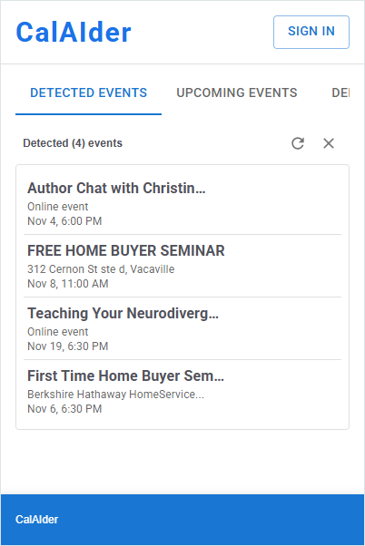

# CalAIder

**Pronounced:** *Cal–eye–der* | Phonetically: `/kæl ˈaɪ dər/`

 <!-- Add your logo here -->

An intelligent Chrome extension that automatically detects events on web pages and seamlessly integrates them with your Google Calendar using AI-powered extraction and Google's built-in Gemini Nano model.

 <!-- Add screenshot of main popup interface -->

---

##  Features

###  AI-Powered Event Detection
- **On-Device AI Processing**: Leverages Chrome's built-in Gemini Nano model for privacy-focused, local event extraction
- **Smart Content Analysis**: Automatically detects event information from any webpage including:
  - Event names and descriptions
  - Dates and times
  - Locations (physical and virtual)
  - JSON-LD structured data
  - Microdata formats
  - Plain text heuristics

###  Google Calendar Integration
- **One-Click Calendar Sync**: Add detected events directly to your Google Calendar
- **OAuth 2.0 Authentication**: Secure sign-in with Google
- **Event Management**: Edit, review, and customize events before adding them
- **Batch Operations**: Manage multiple events from a single page

###  Modern User Interface
- **Material-UI Design**: Clean, intuitive interface built with React and Material-UI
- **Real-Time Updates**: See detected events immediately as you browse
- **Event Preview**: Review and edit event details before adding to calendar
- **Debug Panel**: Built-in debugging tools for developers

 <!-- Add screenshot of event detection in action -->

###  Privacy & Security
- **On-Device Processing**: All AI processing happens locally in your browser
- **Minimal Permissions**: Only requests necessary permissions for calendar access
- **No Data Collection**: Your browsing data never leaves your device
- **Secure OAuth Flow**: Industry-standard authentication with Google

---

##  Repository Structure

```
CalAIder/
├── frontend/CalAIder-frontend/    # Main Chrome extension (React + Vite)
│   ├── src/
│   │   ├── popup/                 # Extension popup UI
│   │   ├── background.js          # Service worker for background tasks
│   │   ├── services/              # Event extraction and AI services
│   │   ├── context/               # React contexts (Google API, Events)
│   │   ├── components/            # Reusable UI components
│   │   └── utils/                 # Date/time formatting utilities
│   ├── public/
│   │   ├── manifest.json          # Current manifest (dev)
│   │   ├── manifest.dev.json      # Development manifest
│   │   ├── manifest.prod.json     # Production manifest
│   │   └── content.js             # Content script for page analysis
│   └── dist/                      # Built extension (generated)
│
├── backend/                       # Backend services (future use)
├── ai_service/                    # AI service utilities
├── promptAPI/                     # Prompt API experimentation
├── extension/                     # Legacy extension files
├── docs/                          # Documentation and images
│   └── images/                    # Screenshots and assets
├── SECURITY_ANALYSIS.md           # Security audit report
├── MANIFEST_GUIDE.md              # Manifest configuration guide
├── PUBLISHING_GUIDE.md            # Chrome Web Store publishing guide
└── README.md                      # This file
```

---

##  Quick Start

### Prerequisites
- Google Chrome browser (version 120+)
- Node.js 16+ and npm
- Google Cloud Console project with Calendar API enabled

### Installation for Development

1. **Clone the repository**
   ```bash
   git clone https://github.com/Kwabena-Manu/CalAIder.git
   cd CalAIder
   ```

2. **Install dependencies**
   ```bash
   cd frontend/CalAIder-frontend
   npm install
   ```

3. **Build the extension**
   ```bash
   npm run build:dev
   ```

4. **Load in Chrome**
   - Open Chrome and go to `chrome://extensions`
   - Enable "Developer mode" (toggle in top-right)
   - Click "Load unpacked"
   - Select the `frontend/CalAIder-frontend/dist` folder

5. **Configure Google OAuth** (if not using existing dev client)
   
<!--  Add screenshot of Chrome extensions page -->

---

##  How to Use

1. **Sign In**: Click the CalAIder extension icon and sign in with your Google account
2. **Browse**: Visit any webpage with event information (meetup.com, eventbrite.com, etc.)
3. **Detect**: CalAIder automatically extracts event details in the background
4. **Review**: Open the popup to see detected events
5. **Add**: Click "Add to Calendar" to sync events with Google Calendar

<!--  Add screenshot showing the workflow -->

---

##  Technology Stack

### Frontend
- **React 19** - UI framework
- **Vite** - Build tool and dev server
- **Material-UI (MUI)** - Component library
- **Chrome Extension APIs** - Browser integration
- **Google Calendar API** - Calendar integration

### AI & Processing
- **Chrome Built-in AI (Gemini Nano)** - On-device language model
- **Prompt API** - Chrome's experimental AI API
- **Custom event extraction** - JSON-LD, microdata, and heuristic parsing

### Authentication
- **Chrome Identity API** - OAuth 2.0 flow
- **Google OAuth 2.0** - Secure authentication

---

##  Documentation

- [Security Analysis](./SECURITY_ANALYSIS.md) - Comprehensive security audit
- [Manifest Configuration Guide](./MANIFEST_GUIDE.md) - Setup for dev/prod environments
- [Publishing Guide](./PUBLISHING_GUIDE.md) - Chrome Web Store deployment
- [Frontend README](./frontend/README.md) - Extension-specific documentation

---

##  Development

### Available Scripts

```bash
# Development build with dev manifest
npm run build:dev

# Production build with production manifest
npm run build:prod

# Start development server (for testing UI components)
npm run dev

# Lint code
npm run lint
```

### Project Structure

See detailed documentation in:
- [Frontend Architecture](./frontend/CalAIder-frontend/README.md)
- [Service Layer Documentation](./frontend/CalAIder-frontend/src/services/README.md)

---

##  Contributing

Contributions are welcome! Please:

1. Fork the repository
2. Create a feature branch (`git checkout -b feature/amazing-feature`)
3. Commit your changes (`git commit -m 'Add amazing feature'`)
4. Push to the branch (`git push origin feature/amazing-feature`)
5. Open a Pull Request

---

##  License

This project is licensed under the MIT License - see the [LICENSE](./LICENSE) file for details.

---

##  Acknowledgments

- Built with Chrome's experimental Built-in AI (Gemini Nano)
- Google Calendar API for seamless integration
- Material-UI for beautiful components
- Google Chrome Built-in AI Challenge 2025

---

## Support

- **Issues**: [GitHub Issues](https://github.com/Kwabena-Manu/CalAIder/issues)
- **Discussions**: [GitHub Discussions](https://github.com/Kwabena-Manu/CalAIder/discussions)

---

##  Roadmap

- [ ] Support for more calendar providers (Outlook, Apple Calendar)
- [ ] Recurring event detection
- [ ] Time zone intelligence
- [ ] Browser notification integration
- [ ] Enhanced AI prompt customization
- [ ] Event conflict detection


---

**Made with ❤️ by the CalAIder Team** 
